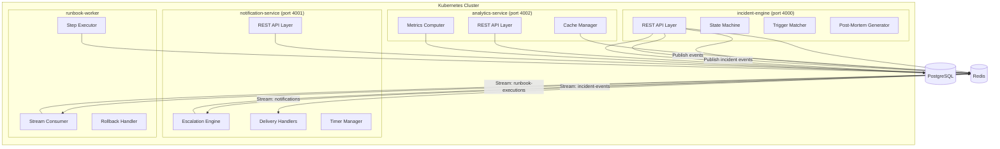
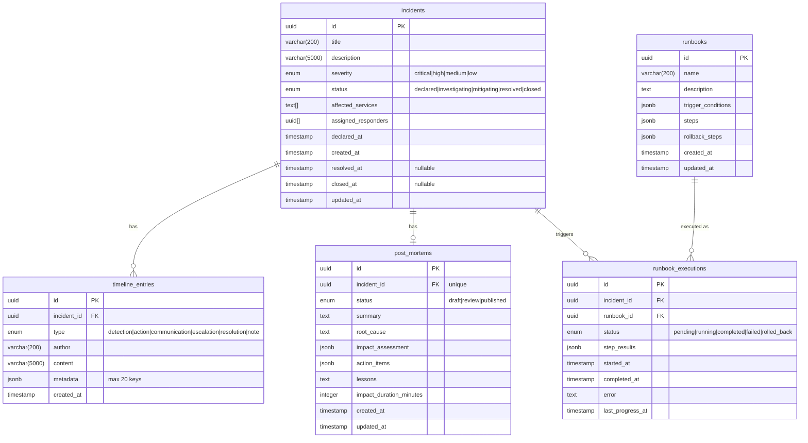
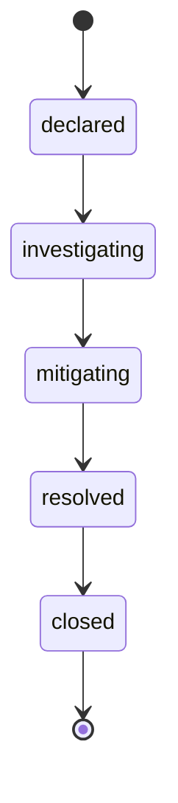

# Design Document

## Overview

The Incident Response Platform is a distributed system comprising four services that collectively manage the full lifecycle of production incidents. The system is designed around event-driven communication, strict state machine semantics for incident lifecycle, and separation of concerns across services.

**Architecture Goals:**
- Strong consistency for incident state transitions (PostgreSQL transactions)
- Eventual consistency for notifications and analytics (Redis Streams)
- Horizontal scalability for each service independently
- Resilience through health probes, retries, and rollback mechanisms
- Auditability through immutable timeline entries

**Service Responsibilities:**
- **incident-engine** (port 4000): Core domain logic — incidents, timelines, severity, status, responders, post-mortems, runbooks, trigger matching
- **notification-service** (port 4001): Notification delivery, escalation policies, auto-escalation timers
- **analytics-service** (port 4002): MTTR, frequency, trends, recurring patterns, team performance
- **runbook-worker**: Background consumer — executes runbook steps, handles retries/rollback, reports progress

## Architecture



### Communication Patterns

| From | To | Mechanism | Purpose |
|------|----|-----------|---------|
| incident-engine | runbook-worker | Redis Stream `runbook-executions` | Trigger runbook execution |
| incident-engine | notification-service | Redis Stream `notifications` | Send notification requests |
| incident-engine | notification-service | Redis Stream `incident-events` | Incident state changes for auto-escalation |
| runbook-worker | incident-engine | Redis Stream `execution-progress` | Report step completion |
| notification-service | incident-engine | HTTP callback | Create escalation timeline entries |

### Concurrency Model

The incident-engine uses PostgreSQL advisory locks for concurrent status transitions on the same incident. This ensures serialization of transitions (Requirement 17.5) without global locking.

```sql
SELECT pg_advisory_xact_lock(incident_id_hash);
-- Read current status, validate transition, apply
```

## Components and Interfaces

### incident-engine API (port 4000)

#### Incidents

| Method | Path | Description |
|--------|------|-------------|
| POST | /incidents | Declare a new incident |
| GET | /incidents | List incidents with filters |
| GET | /incidents/:id | Get incident by ID |
| PATCH | /incidents/:id/status | Transition status |
| PATCH | /incidents/:id/severity | Escalate severity |
| POST | /incidents/:id/responders | Assign responders |

#### Timeline

| Method | Path | Description |
|--------|------|-------------|
| POST | /incidents/:id/timeline | Add timeline entry |
| GET | /incidents/:id/timeline | Get incident timeline |

#### Post-Mortems

| Method | Path | Description |
|--------|------|-------------|
| POST | /incidents/:id/postmortem | Generate post-mortem |
| GET | /incidents/:id/postmortem | Get post-mortem |

#### Runbooks

| Method | Path | Description |
|--------|------|-------------|
| POST | /runbooks | Create runbook |
| GET | /runbooks | List runbooks |
| GET | /runbooks/:id | Get runbook |
| POST | /runbooks/:id/execute | Trigger execution |
| GET | /incidents/:id/suggested-runbooks | Get matching runbooks |

#### Health

| Method | Path | Description |
|--------|------|-------------|
| GET | /health | Liveness probe |
| GET | /ready | Readiness probe (DB + Redis) |

### notification-service API (port 4001)

| Method | Path | Description |
|--------|------|-------------|
| POST | /notifications | Send notification |
| GET | /incidents/:id/notifications | List notifications for incident |
| POST | /escalation-policies | Create escalation policy |
| GET | /escalation-policies | List policies |
| GET | /escalation-policies/:id | Get policy |
| GET | /health | Liveness probe |
| GET | /ready | Readiness probe (Redis) |

### analytics-service API (port 4002)

| Method | Path | Description |
|--------|------|-------------|
| GET | /metrics/mttr | MTTR by severity |
| GET | /metrics/frequency | Incident frequency over time |
| GET | /metrics/trends | Week-over-week trends |
| GET | /metrics/severity-distribution | Severity distribution |
| GET | /metrics/recurring-patterns | Recurring service patterns |
| GET | /metrics/team-performance | Team response metrics |
| GET | /health | Liveness probe |
| GET | /ready | Readiness probe (Redis) |

### runbook-worker (no HTTP API)

The runbook-worker is a headless consumer that reads from Redis Stream `runbook-executions` and publishes progress to `execution-progress`.

#### Internal Interfaces

```typescript
interface StepExecutor {
  execute(step: RunbookStep, context: ExecutionContext): Promise<StepResult>;
}

interface RollbackHandler {
  rollback(steps: RunbookStep[], results: StepResult[]): Promise<RollbackResult>;
}
```

### Shared Types (cross-service)

```typescript
// Incident events published to Redis Streams
interface IncidentEvent {
  type: 'declared' | 'status_changed' | 'severity_changed' | 'responder_assigned';
  incidentId: string;
  timestamp: string; // ISO 8601
  payload: Record<string, unknown>;
}

// Notification request on notifications stream
interface NotificationRequest {
  channel: 'slack' | 'email' | 'pagerduty';
  recipients: string[];
  message: string;
  incidentId: string;
}
```

## Data Models

### PostgreSQL Schema



### Incident State Machine



Valid transitions are strictly linear:
- `declared` → `investigating`
- `investigating` → `mitigating`
- `mitigating` → `resolved` (requires resolution timeline entry)
- `resolved` → `closed`

No backwards transitions. No skipping. No transitions from `closed`.

### Severity Ordering

```
low < medium < high < critical
```

Severity can only escalate (increase) during active statuses (`declared`, `investigating`, `mitigating`). No changes allowed on `resolved` or `closed`.

### Redis Data Structures

| Key Pattern | Type | Purpose | TTL |
|-------------|------|---------|-----|
| `stream:runbook-executions` | Stream | Runbook execution jobs | N/A |
| `stream:notifications` | Stream | Notification delivery jobs | N/A |
| `stream:incident-events` | Stream | Incident state change events | N/A |
| `stream:execution-progress` | Stream | Runbook step progress | N/A |
| `cache:mttr` | String (JSON) | Cached MTTR metrics | 600s |
| `cache:frequency:{hash}` | String (JSON) | Cached frequency metrics | 600s |
| `cache:trends` | String (JSON) | Cached trend metrics | 600s |
| `cache:recurring-patterns` | String (JSON) | Cached recurring patterns | 600s |
| `cache:team-performance:{hash}` | String (JSON) | Cached team metrics | 600s |
| `escalation:{incidentId}` | Hash | Pending escalation state | Until cancelled |
| `notification:{id}:retries` | String | Retry counter per notification | 3600s |

### Key TypeScript Interfaces

```typescript
// Core domain types
type Severity = 'critical' | 'high' | 'medium' | 'low';
type IncidentStatus = 'declared' | 'investigating' | 'mitigating' | 'resolved' | 'closed';
type TimelineEntryType = 'detection' | 'action' | 'communication' | 'escalation' | 'resolution' | 'note';
type NotificationChannel = 'slack' | 'email' | 'pagerduty';
type RunbookStepType = 'manual' | 'automated';
type ExecutionStatus = 'pending' | 'running' | 'completed' | 'failed' | 'rolled_back';

interface Incident {
  id: string;
  title: string;
  description: string;
  severity: Severity;
  status: IncidentStatus;
  affectedServices: string[];
  assignedResponders: string[];
  declaredAt: string;
  createdAt: string;
  resolvedAt: string | null;
  closedAt: string | null;
  updatedAt: string;
}

interface TimelineEntry {
  id: string;
  incidentId: string;
  type: TimelineEntryType;
  author: string;
  content: string;
  metadata: Record<string, string> | null;
  createdAt: string;
}

interface PostMortem {
  id: string;
  incidentId: string;
  status: 'draft' | 'review' | 'published';
  summary: string;
  rootCause: string;
  impactAssessment: {
    affectedServices: string[];
    durationMinutes: number;
  };
  actionItems: ActionItem[];
  lessons: string;
  timeline: TimelineEntry[];
  createdAt: string;
  updatedAt: string;
}

interface ActionItem {
  id: string;
  description: string;
  assignee: string;
  priority: 'high' | 'medium' | 'low';
  dueDate: string;
  status: 'open' | 'in_progress' | 'done';
}

interface Runbook {
  id: string;
  name: string;
  description: string;
  triggerConditions: TriggerCondition[];
  steps: RunbookStep[];
  rollbackSteps: RunbookStep[];
  createdAt: string;
  updatedAt: string;
}

interface TriggerCondition {
  field: string;
  operator: 'equals' | 'contains' | 'gt' | 'lt';
  value: string;
}

interface RunbookStep {
  order: number;
  name: string;
  type: RunbookStepType;
  command?: string; // Required for automated steps
  expectedOutcome: string;
  timeout: number; // seconds, positive integer
  retries: number; // non-negative, max 10
}

interface StepResult {
  stepOrder: number;
  status: 'success' | 'failed' | 'skipped' | 'timed_out';
  output: string; // truncated to 10,000 chars
  durationMs: number;
  retryCount: number;
}

interface RunbookExecution {
  id: string;
  incidentId: string;
  runbookId: string;
  status: ExecutionStatus;
  stepResults: StepResult[];
  startedAt: string | null;
  completedAt: string | null;
  lastProgressAt: string | null;
  error: string | null;
}

interface EscalationPolicy {
  id: string;
  name: string;
  levels: EscalationLevel[];
  createdAt: string;
  updatedAt: string;
}

interface EscalationLevel {
  targets: string[];
  notifyAfter: number; // minutes, 1-1440
  channels: NotificationChannel[];
}

interface Notification {
  id: string;
  incidentId: string;
  channel: NotificationChannel;
  recipients: string[];
  message: string;
  status: 'pending' | 'delivered' | 'failed';
  error: string | null;
  retryCount: number;
  createdAt: string;
}
```

## Correctness Properties

*A property is a characteristic or behavior that should hold true across all valid executions of a system — essentially, a formal statement about what the system should do. Properties serve as the bridge between human-readable specifications and machine-verifiable correctness guarantees.*

### Property 1: Incident creation invariants

*For any* valid incident declaration (non-empty title ≤200 chars, non-empty description ≤5000 chars, valid severity, at least one affected service), the created incident SHALL have status "declared", a unique identifier, declaredAt equal to createdAt, and a timeline entry of type "detection" as the first entry.

**Validates: Requirements 1.1, 1.2, 1.3**

### Property 2: Invalid declaration rejection

*For any* incident declaration request that is missing required fields, has whitespace-only title or description, or specifies an invalid severity value, the system SHALL reject the request with a 400 error and not create any incident record.

**Validates: Requirements 1.4, 1.5, 1.6**

### Property 3: Filter correctness

*For any* set of persisted incidents and any combination of status filter, severity filter, and date range filter, all incidents returned by a list query SHALL satisfy every applied filter predicate (status matches, severity matches, declaredAt within range inclusive).

**Validates: Requirements 2.2, 2.3, 2.4**

### Property 4: List ordering and pagination

*For any* set of persisted incidents, the list endpoint SHALL return incidents ordered by declaredAt descending, with page size between 1 and 100 (defaulting to 20), and the total count of paginated results SHALL equal the total matching incidents.

**Validates: Requirements 2.1**

### Property 5: State machine transition validity

*For any* incident in any status and any target status, a status transition request SHALL succeed if and only if the (current, target) pair is in the valid transition set {(declared, investigating), (investigating, mitigating), (mitigating, resolved), (resolved, closed)}, and the preconditions are met (resolution entry exists for mitigating→resolved).

**Validates: Requirements 3.1, 3.2, 3.3, 3.4, 17.1**

### Property 6: Timestamp invariants after state transitions

*For any* incident after any sequence of operations: resolvedAt SHALL be non-null if and only if status is "resolved" or "closed"; closedAt SHALL be non-null if and only if status is "closed"; and both timestamps SHALL be null for all other statuses.

**Validates: Requirements 3.5, 3.6, 17.2, 17.3**

### Property 7: Status transitions produce timeline entries

*For any* successful status transition, the incident timeline SHALL contain a new entry of type "action" recording the previous status and new status, with a timestamp at or after the transition request time.

**Validates: Requirements 3.7**

### Property 8: Severity monotonicity during active incidents

*For any* incident with status in {declared, investigating, mitigating} and any severity change request, the change SHALL succeed if and only if the requested severity is strictly greater than the current severity in the ordering low < medium < high < critical. The system SHALL reject downgrades, same-level changes, and all severity changes on resolved/closed incidents.

**Validates: Requirements 4.1, 4.2, 4.3, 4.5, 4.6, 17.4**

### Property 9: Severity escalation produces timeline entry

*For any* successful severity escalation, the incident timeline SHALL contain a new entry of type "escalation" recording the previous and new severity levels.

**Validates: Requirements 4.4**

### Property 10: Timeline ordering invariant

*For any* incident with multiple timeline entries, the entries returned by the timeline endpoint SHALL be ordered by timestamp ascending (earliest first), regardless of insertion order.

**Validates: Requirements 5.3**

### Property 11: Timeline metadata round-trip

*For any* timeline entry submitted with metadata (≤20 keys, each key ≤100 chars, each value ≤500 chars), retrieving the entry SHALL return metadata with identical keys and values.

**Validates: Requirements 5.4**

### Property 12: Responder assignment idempotence

*For any* incident and any responder identifier, assigning the same responder multiple times SHALL result in exactly one occurrence of that responder in the assigned list, and the operation SHALL return success each time.

**Validates: Requirements 6.1, 6.3**

### Property 13: Post-mortem generation correctness

*For any* resolved or closed incident, the generated post-mortem SHALL have status "draft", impact_duration_minutes equal to (resolvedAt - declaredAt) in minutes, affected services matching the incident's affected services, and a timeline containing all incident timeline entries.

**Validates: Requirements 7.1, 7.2, 7.3, 7.4**

### Property 14: Runbook step order uniqueness

*For any* runbook creation request, if two or more steps share the same order value, the system SHALL reject the request with a 400 error. If all orders are unique, the runbook SHALL be created successfully (given all other fields are valid).

**Validates: Requirements 8.3**

### Property 15: Runbook validation

*For any* runbook creation request, the system SHALL reject the request if any step is missing name, type, expectedOutcome, timeout (positive integer), or retries (0-10), or if an automated step is missing a non-empty command field.

**Validates: Requirements 8.2, 8.6**

### Property 16: Execution step sequencing

*For any* runbook with a defined step sequence, the runbook-worker SHALL execute automated steps in strictly ascending order of the step order field, skipping manual steps entirely.

**Validates: Requirements 9.2**

### Property 17: Exponential backoff on step failure

*For any* failing runbook step with retry count N (1 ≤ N ≤ 3), the worker SHALL apply delays of 1s, 2s, 4s (capped at 8s) between retry attempts, following the formula delay = min(2^(attempt-1), 8) seconds.

**Validates: Requirements 9.4, 18.5**

### Property 18: Rollback execution on failure

*For any* runbook execution where a step fails after exhausting retries, the worker SHALL execute rollback steps in reverse order of their defined sequence, continuing execution of remaining rollback steps even if one fails.

**Validates: Requirements 9.5**

### Property 19: Execution final status determination

*For any* runbook execution: if all steps succeed, the final status SHALL be "completed"; if a step fails and all rollback steps succeed, the final status SHALL be "rolled_back"; if a step fails and any rollback step also fails, the final status SHALL be "failed".

**Validates: Requirements 18.2, 18.3, 18.4**

### Property 20: Step result completeness

*For any* completed runbook execution, the step results array length SHALL equal the number of steps attempted, and each result SHALL contain status (success|failed|skipped|timed_out), output (≤10,000 characters), durationMs (non-negative), and retryCount (non-negative).

**Validates: Requirements 9.6, 18.1**

### Property 21: Escalation policy level ordering

*For any* escalation policy creation request with multiple levels, the system SHALL accept the policy if and only if the notifyAfter values are strictly increasing across levels (each level's notifyAfter > previous level's notifyAfter).

**Validates: Requirements 11.2, 11.3**

### Property 22: Status change cancels escalation timers

*For any* incident with active escalation timers, performing a status transition SHALL cancel all pending escalation timers for that incident and reset the escalation sequence.

**Validates: Requirements 12.4**

### Property 23: MTTR computation correctness

*For any* set of resolved incidents grouped by severity, the computed MTTR for each severity level SHALL equal the arithmetic mean of (resolvedAt - declaredAt) in minutes, and SHALL be zero when no resolved incidents exist for that severity. All MTTR values SHALL be non-negative.

**Validates: Requirements 13.1, 13.2, 13.3**

### Property 24: Frequency bucketing with zero-fill

*For any* valid time range and interval (daily, weekly, monthly), the frequency endpoint SHALL return contiguous time buckets covering the entire range with no gaps, including buckets with zero incidents.

**Validates: Requirements 14.1**

### Property 25: Week-over-week trend computation

*For any* sequence of weekly incident counts where the previous week count is non-zero, the trend percentage SHALL equal ((current - previous) / previous) × 100. When the previous week has zero incidents, the trend SHALL be null.

**Validates: Requirements 14.2, 14.3**

### Property 26: Severity distribution completeness

*For any* query, the severity distribution SHALL always return counts for all four severity levels (critical, high, medium, low), returning zero for levels with no incidents.

**Validates: Requirements 14.4**

### Property 27: Recurring pattern identification

*For any* set of incidents within a 30-day window, the recurring patterns endpoint SHALL return services appearing in more than one incident, limited to top 10, ordered by incident count descending.

**Validates: Requirements 15.1, 15.4**

### Property 28: Team performance metrics computation

*For any* set of resolved incidents with responder assignments within a time range, mean response time per responder SHALL equal the arithmetic mean of (first assignment timestamp - declaredAt) in seconds, and mean resolution time SHALL equal the arithmetic mean of (resolvedAt - declaredAt) in seconds.

**Validates: Requirements 15.2, 15.3**

### Property 29: Trigger condition operator semantics

*For any* incident field value and trigger condition: "equals" SHALL match iff values are identical (case-sensitive); "contains" SHALL match iff condition value is a case-insensitive substring of field value; "gt" SHALL match iff numeric field value > numeric condition value; "lt" SHALL match iff numeric field value < numeric condition value; non-numeric field values with gt/lt SHALL not match.

**Validates: Requirements 19.2, 19.3, 19.4, 19.5, 19.6**

### Property 30: Trigger condition conjunction and runbook suggestion

*For any* incident and set of runbooks, a runbook SHALL appear in the suggested remediations list if and only if ALL of its trigger conditions match the incident attributes. When multiple runbooks match, they SHALL be ordered by creation time ascending (oldest first).

**Validates: Requirements 19.7, 19.8, 19.9**

### Property 31: Incident JSON serialization round-trip

*For any* valid incident record, serializing to JSON and parsing back SHALL produce a semantically equivalent document (same keys and values with identical types), regardless of key ordering.

**Validates: Requirements 20.2, 20.3**

### Property 32: Concurrent status transition serialization

*For any* two or more concurrent status transition requests on the same incident, the system SHALL serialize them such that each request is evaluated against the current committed status, resulting in at most one successful transition per conflicting pair.

**Validates: Requirements 17.5**

## Error Handling

### Error Response Format

All services use a consistent error response structure:

```typescript
interface ErrorResponse {
  error: {
    code: string;       // Machine-readable error code
    message: string;    // Human-readable description
    details?: Record<string, unknown>; // Additional context
  };
  statusCode: number;
}
```

### Error Categories

| HTTP Status | Code | When |
|-------------|------|------|
| 400 | `VALIDATION_ERROR` | Missing/invalid fields, invalid transitions, invalid severity changes |
| 404 | `NOT_FOUND` | Incident, runbook, or policy not found |
| 409 | `CONFLICT` | Post-mortem already exists for incident |
| 503 | `SERVICE_UNAVAILABLE` | Database or Redis unavailable |

### Retry Strategy

| Component | Failure Type | Retries | Backoff | Max Delay |
|-----------|-------------|---------|---------|-----------|
| notification-service | Delivery failure | 3 | Exponential | 8s |
| runbook-worker | Step failure | Per-step config (max 10) | Exponential (1s base) | 8s |
| All services | Redis connection | 3 | Exponential (500ms base) | 4s |
| All services | PostgreSQL connection | 3 | Exponential (1s base) | 8s |

### Circuit Breaker (notification-service)

External delivery channels (Slack, PagerDuty, email) use a circuit breaker pattern:
- **Closed**: Normal operation, tracking failure count
- **Open**: After 5 consecutive failures, reject immediately for 30s
- **Half-Open**: Allow one request through, reset if successful

### Graceful Degradation

- If Redis is unavailable, analytics-service returns 503 (cannot check cache or compute)
- If PostgreSQL is unavailable during writes, incident-engine returns 503 with no partial records
- If runbook-worker loses connection mid-execution, the 30-second watchdog marks execution as "failed"
- Escalation timers are stored in Redis; if Redis restarts, timers are lost and re-evaluated on next incident event

## Testing Strategy

### Property-Based Testing (fast-check)

The platform uses `fast-check` as the property-based testing library for all property tests.

**Configuration:**
- Minimum 100 iterations per property test (`numRuns: 100`)
- Each property test references its design document property with a tag comment
- Tag format: `// Feature: incident-response-platform, Property {N}: {title}`

**Property Test Coverage:**
- State machine transitions (Properties 5, 6, 8, 32)
- Severity ordering and monotonicity (Property 8)
- Filter correctness (Properties 3, 4)
- Timeline ordering (Property 10)
- Trigger condition matching (Properties 29, 30)
- Computation correctness — MTTR, frequency, trends (Properties 23, 24, 25, 26, 27, 28)
- Serialization round-trip (Property 31)
- Runbook execution semantics (Properties 16, 17, 18, 19, 20)
- Escalation policy validation (Property 21)
- Idempotence (Property 12)

**Generators to Build:**
- `arbitraryIncident()` — random valid incidents with all field constraints
- `arbitrarySeverity()` — random severity from valid set
- `arbitraryStatus()` — random status from valid set
- `arbitraryTimelineEntry()` — random valid timeline entries
- `arbitraryRunbook()` — random valid runbooks with steps
- `arbitraryTriggerCondition()` — random trigger conditions with operators
- `arbitraryEscalationPolicy()` — random valid escalation policies
- `arbitraryStatusTransitionSequence()` — random sequences of valid/invalid transitions

### Unit Testing (Jest)

Unit tests cover specific examples, edge cases, and error conditions:
- Validation error messages contain correct field names
- Specific boundary values (title exactly 200 chars, description exactly 5000 chars)
- Empty arrays, null values, boundary integers
- Post-mortem uniqueness conflict (409)
- 404 responses for non-existent resources
- Whitespace-only field rejection

### Integration Testing

Integration tests verify cross-service communication and data persistence:
- Redis Stream publish/consume for runbook execution
- Redis Stream publish/consume for notifications
- PostgreSQL transaction rollback on failure
- Cascade deletion of timeline entries
- Health/readiness probe behavior with dependencies up/down
- Auto-escalation timer triggering
- Concurrent status transition serialization (advisory locks)

### Test Organization

```
services/
  incident-engine/
    src/
    tests/
      unit/           # Jest unit tests
      property/       # fast-check property tests
      integration/    # DB/Redis integration tests
  notification-service/
    src/
    tests/
      unit/
      property/
      integration/
  analytics-service/
    src/
    tests/
      unit/
      property/
      integration/
  runbook-worker/
    src/
    tests/
      unit/
      property/
      integration/
```

### Test Commands

```bash
# Unit + property tests (fast, no external dependencies)
npm run test:unit

# Integration tests (requires Docker PostgreSQL + Redis)
npm run test:integration

# All tests
npm run test

# Property tests only
npm run test:property
```

